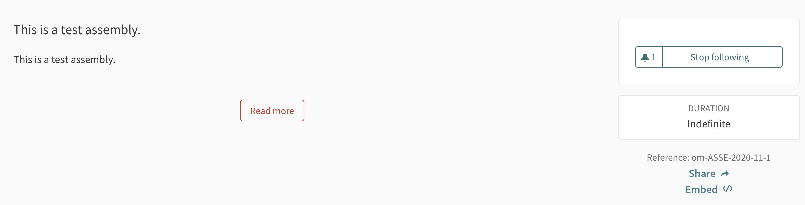

# README

## Startup

```bash
docker build -t dfithian/decidim:latest .
docker run -it --rm -p 3000:3000 dfithian/decidim:latest
```

## To get a console for debugging purposes

You shouldn't need this if everything is working normally.

```bash
docker exec -it $(docker ps | grep "dfithian/decidim:latest" | awk '{print $1}') /bin/bash
```

## Browser

Navigate to `http://localhost:3000/system` to create an organization (see `seeds.rb` for the username and password).

Here are the settings:


While no welcome email will be sent to the admin user for the organization, the contents of the email are logged in the Docker container.
If you search for "Someone has invited you to OpenMaine", you should be able to copy/paste the invite link into your browser to register.
You will then get redirected to the admin dashboard.


After creating the organization, go to `http://localhost:3000` to get the homepage.


## Notes

### Email

* This doesn't include a mail server. If we want to send newsletters or signup emails we need to hook in to an email server.

### Administration

`https://docs.decidim.org/en/admin/`

This platform needs an administrator to set it up and organize the general website, write copy, send newsletters, etc.
This administrator does not need to be technical.

#### Processes

The administrator will need to create and maintain any participatory processes.


A process has a start and end date, and phases of participation. Once it's published, it shows up in the process list view.


The detail view shows the information that was configured.


#### Assemblies

The administrator will need to create any maintain any assemblies.


For the user, assemblies are similar to processes.




#### Pages

The administrator will need to add any help pages.


They show up to the user under the "Help" section.


#### Newsletters

The administrator can send newsletters (see note about needing a mail server to talk to).


#### Settings

The administrator can change any info about the organization.
A designer here could help with the appearance and page layout.


#### Static pages

Someone will need to write an FAQ page.


#### Shortcomings of documentation

Administration of participants, spaces, components, and newsletters is either outdated or missing.
